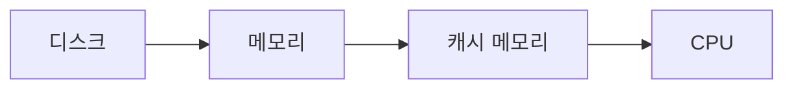

# 하테나의 서비스 규모

* 등록 사용자 : 100만명 이상, 1500만 UU(Unique User, 고유 사용자)/월
* 수십 억 액세스/월(이미지 등으로의 액세스는 제외)
* 피크 시 회선 트래픽 양은 430Mbps
* 하드웨어(서버)는 500대 이상

하테나는 일본에서 큰 웹 서비스 중 하나이며 DB 서버가 저장하는 데이터 규모는 대략 기가바이트이며 많을 때는 테라바이트가 된다.

> ##### TIP
>
> 구글이나 패이스북 같은 더 큰 서비스는 테라바이트를 넘어서 페타바이트 급의 초 대규모 서비스이다.
{: .block-tip }

# 소규모 서비스와 대규모 서비스의 차이

서버 몇 대 정도만 있는 소규모 서비스에는 없는 대규모 서비스에만 있는 문제나 어려움은 어떤 것들이 있을까?

## 부하분산

대량의 액세스가 있는 서비스에서 서버 1대로 처리할 수 없는 부하를 어떻게 처리할 것인지가 가장 큰 문제이다.
최근 트렌드로는 스케일아웃(scale-out) 방식이 이러한 문제에 대한 기초가 되었다.

스케일아웃은 서버를 횡으로 전개, 즉 서버의 역할을 분담하거나 대수를 늘림으로써 시스템의 전체적인 처리능력을 높여서 부하를 분산하는 방법이다.

반면에 스케일업(scale-up)은 하드웨어의 성능을 높여 처리능력을 끌어올리는 방법이다.

> ##### TIP
>
> 하지만 하드웨어의 가격은 성능에 비례하지 않기 때문에 저가의 하드웨어를 횡으로 나열해서 확장성을 확보하는 스케일아웃 전략을 더 많이 채용한다.
{: .block-tip }

### 스케일아웃이 가져오는 문제점

하지만 스케일아웃 전력을 사용해서 서버의 갯수를 늘렸을 때 문제점이 발생한다. 바로 요청을 어떤 서버로 보낼지 결정해주어야 한다는 것이다.
이는 로드밸런서를 사용하면 간단하게 해결할 수 있다.

그리고 데이터 동기화는 어떻게 할 것인가? DB를 분산시켰을 때 한쪽에 저장된 갱신 내용을 다른 DB가 알지 못하면 애플리케이션에 비정상 상태가 발생한다

마지막으로 네트워크 통신 지연시간을 어떻게 처리할 것인가?
작은 데이터라도 이더넷을 경유해 통신한 경우 밀리초 단위의 지연시간이 발생한다. 컴퓨터는 이보다 더 작은 단위인 마이크로초나 나노초로 작동하는 컴퓨터도 있기에 밀리초는 그들에게 큰 지연이다.
이처럼 통신의 오버헤드를 최소한으로 줄여가면서 애플리케이션을 구성해갈 필요가 있따.

## 다중성 확보

특정 서버가 고장 나거나 성능이 저하되더라도 서비스를 계속할 수 있는 구성으로 할 필요가 있다.

만약 스케일아웃을 해서 서버 대수가 늘어나면 서버의 고장률도 늘어난다. 웹 서비스에서 고장은 항시 돌아가야하는 특성 상 용남될 수 없는 문제이다.
따라서 서버가 고장나더라도 혹은 급격하게 부하가 올라갈 경우에도 견딜 수 있는 시스템을 구성할 필요가 있다.

## 효율적 운용 필요

서버의 대수가 많아질 수록 서버가 정상적으로 동작하고 있는지 파악하기 어려워진다.
따라서 서버의 대수가 많아지면 감시용 소프트웨어를 사용하고 정보관리를 위한 툴을 사용하는 등 자동화를 하게 된다.

하지만 이를 설치하는 것도 인간이고 툴을 사용하는 것도 인간이다. 대규모 서비스를 유지하기 위해서는 많은 일손을 거치지 않고 시스템을 건강한 상태로 얼마나 유지할 수 있는지도 중요하다.
따라서 효율적인 운용이 중요한 것이다.

## 개발자 수, 개발방법의 변화

대규모 서비스가 되면 그에 따라 코드 량도 증가하게 되고 서버의 양, 데이터베이스의 양도 증가한다.
따라서 팀이 늘어나고 팀원이 늘어나게 된다.
코드 부분에서는 사내 개발 표준화가 진행되어야 한다. 프로그래밍 언어를 통일하고, 라이브러리나 프레임워크를 통일하고, 코딩 규약을 정해서 표준화해야 한다.

이러한 규칙이 있어야 프로그램이 제대로 유지될 수 있다.

# 대규모 데이터량에 대한 대처

데이터는 하드웨어에서 이러한 전달 순서를 가지고 각 단계 건애 속도차가 매우 크게 나는 것이 현태 컴퓨터의 특징이다.
데이터를 읽는데 I/O 속도가 매우 중요해지며, 캐시 미스 등 다양한 문제가 있으며 이를 해결하는 것이 중요하다.

> ##### TIP
>
> 어떻게 하면 데이터를 적게 가져갈 수 있을까, 여러 서버로 분산시킬 수 있을까, 필요한 데이터를 최소한의 횟수로 읽어들일 수 있을까가 본질적인 과제이다.
{: .block-tip }

